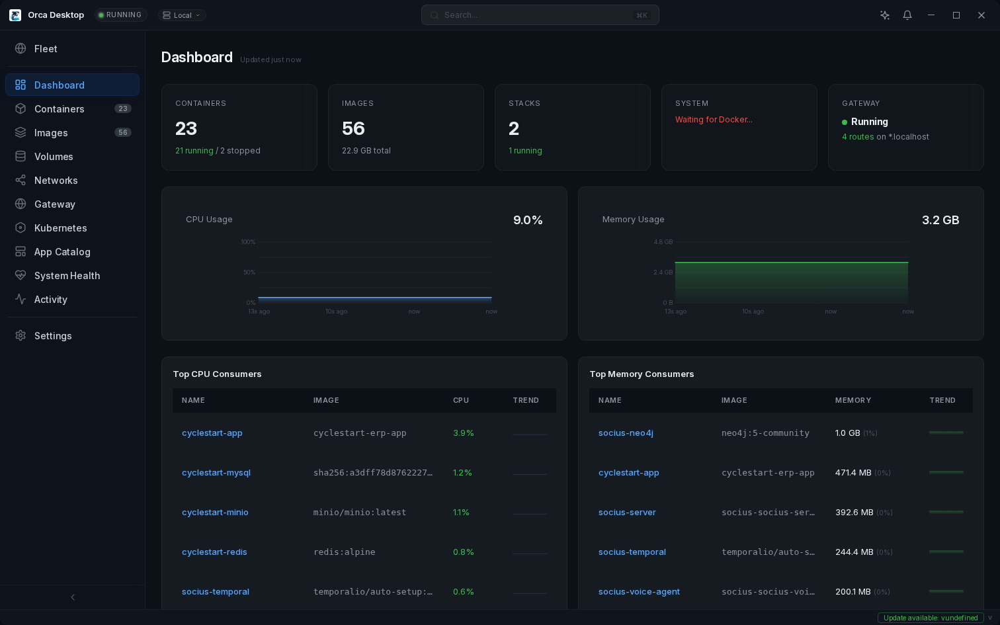
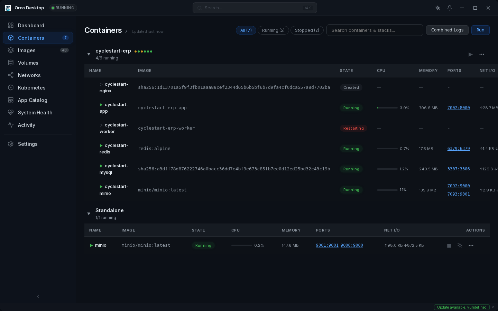
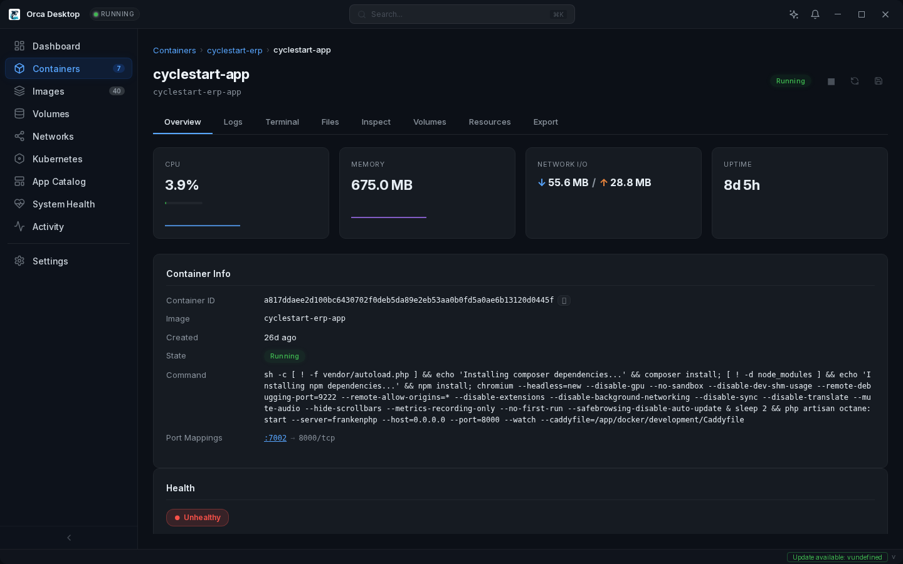
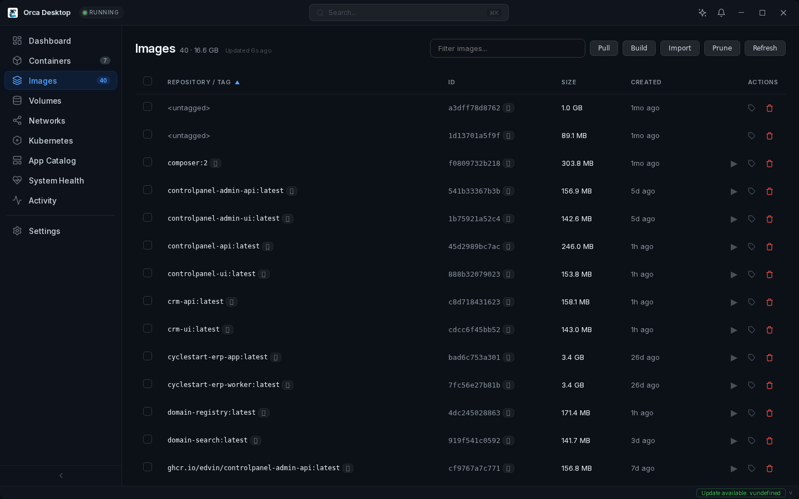
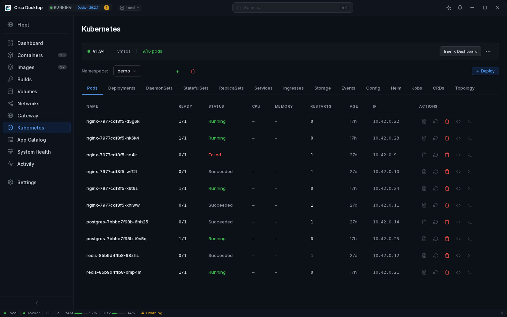
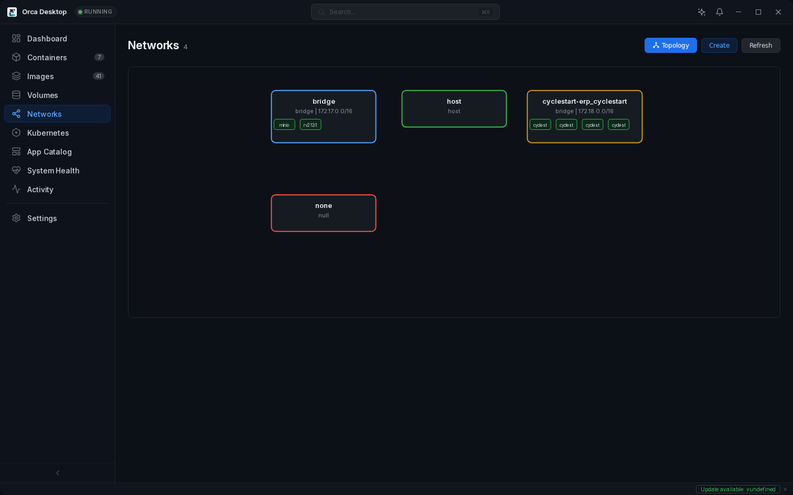
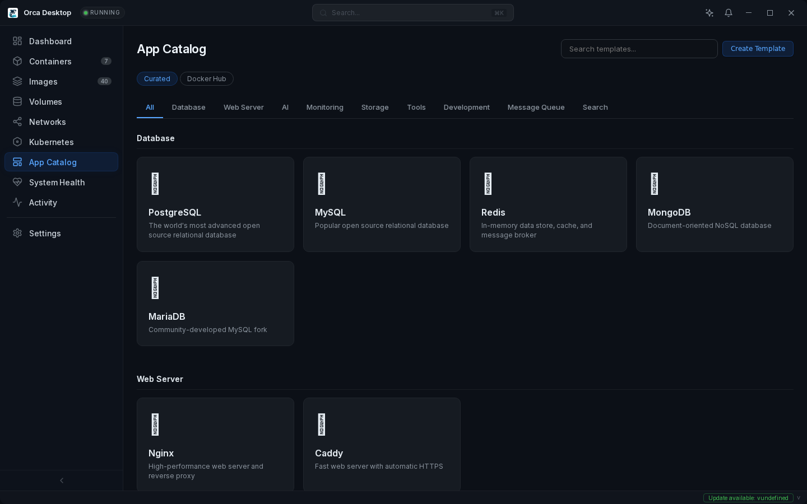
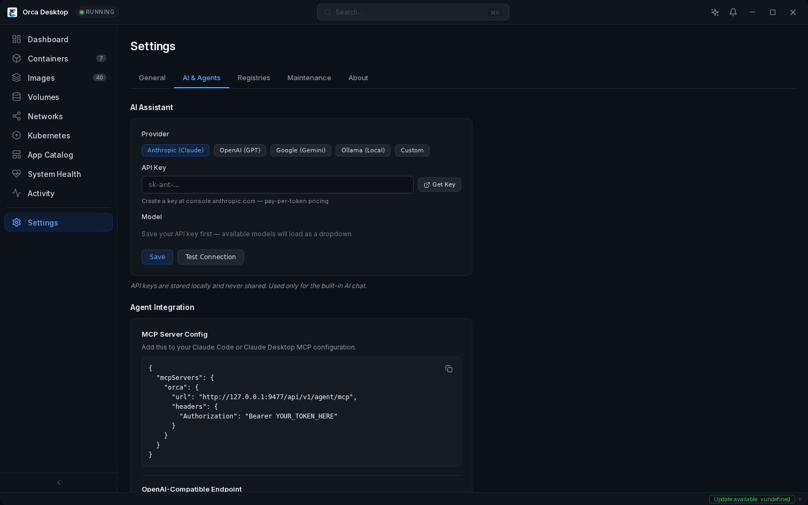
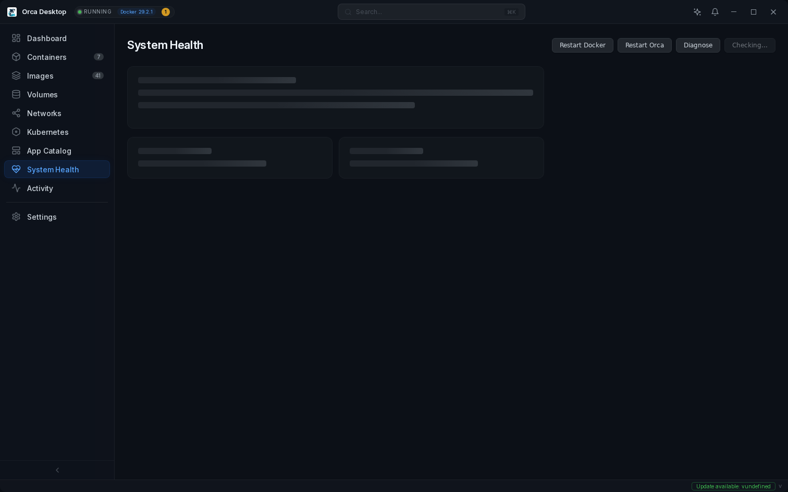

<p align="center">
  
</p>

<h1 align="center">Orca Desktop</h1>

<p align="center">
  <strong>Open source container management desktop app with built-in AI.</strong><br>
  Containers, images, compose stacks, Kubernetes, AI assistant, and agent APIs — all in one place.
</p>

<p align="center">
  
</p>

<p align="center">
  
  
</p>

<p align="center">
  <a href="https://orca-desktop.com">Website</a> · <a href="https://github.com/edvin/orca/releases/latest">Download</a> · Open source. Built with Rust, Tauri, and SolidJS.
</p>

## Features

### Container Management

- **Full lifecycle** — create, start, stop, restart, kill, remove, **rename** containers
- **Stop all** — one-click stop all running containers with confirmation
- **Run containers** with ports, volumes, env vars, restart policies, CPU/memory limits
- **Image tag autocomplete** — type `nginx`, see `:latest`, `:alpine`, `:1.27` from Docker Hub
- **Live resource editing** — change memory limits, CPU cores, and restart policy on running containers
- **Per-container resource charts** — full-size CPU and memory time-series on the detail page
- **Resource usage alerts** — toast when containers exceed 90% memory or sustained CPU
- **Exec terminal** — interactive shell inside containers
- **Live log streaming** — real-time log tailing via SSE, per-layer pull progress bars
- **Log viewer** with regex search, match highlighting, case sensitivity toggle, and download
- **Multi-container log view** — combined, color-coded logs across containers
- **Health checks** — live status indicator, health history, check output
- **Restart count** — badge showing how many times a container has restarted
- **Container file browser** — explore filesystem of running containers
- **Export to tar** — save container filesystem or image to tar file
- **Save as Image** — commit container state to a new image
- **AI-powered diagnostics** — click the AI button on any container to analyze logs and troubleshoot
- **Copy as `docker run`** / **Export as `docker-compose.yml`** for any running container
- Real-time event streaming (instant UI updates on container state changes)

### Image Management

- **Pull images** with Docker Hub search, **per-layer progress bars**, and streaming download
- **Build images** from Dockerfile with streaming output, build args, and Dockerfile selection
- **Vulnerability scanning** — one-click CVE scan powered by Trivy with severity badges
- **Image layer visualization** — stacked bar chart with Dockerfile instructions
- **Browse image files** — explore any image's filesystem without running it
- **Tag images** with custom repository and version
- **Import from tar** — load images from tar archives
- **Prune** unused images with confirmation dialog and space reclaimed reporting
- **Registry authentication** for private registries (Docker Hub, GitHub, GitLab, AWS ECR)

### Compose Stacks

- **Auto-detection** from container labels — no config file needed
- **Compose editor** — create new docker-compose.yml with YAML editor and deploy from the UI
- **Compose validation** — validates via `docker compose config` before deploy, errors shown inline
- Service health dots with stack status rollup (Running / Partial / Stopped)
- **Compose up / down / pull** — runs the actual `docker compose` CLI
- Per-service logs, start/stop, restart within expanded stack view
- Edit existing compose files with Monaco YAML editor and hot-reload

### Kubernetes (k3s)

- **One-click k3s cluster** with Traefik ingress controller and progress dialog
- **20+ resource types**: Pods, Deployments, DaemonSets, StatefulSets, ReplicaSets, Services, Ingresses, Jobs, CronJobs, ConfigMaps, Secrets, PVCs, PVs, Storage Classes, HPAs, Network Policies, CRDs, Helm releases
- **HPA autoscaling** — create, monitor, target CPU with min/max replicas
- **Secrets management** — full CRUD with type selection (Opaque, TLS, Docker) and reveal toggle
- **CRD browser** — list Custom Resource Definitions with group, kind, scope
- **Helm management** — list releases, install charts, uninstall
- **Visual topology** — Service → Deployment → Pods relationship map
- **Pod terminal** — interactive shell into running pods
- **Deploy from YAML** — Monaco editor with syntax highlighting
- Uses "orca" context in standard `~/.kube/config` — never touches user's remote clusters
- `kubectl --context orca get pods` works out of the box

### App Templates

- **One-click deployable apps** — databases, web servers, monitoring, AI, dev tools, and more
- **Community catalog** — templates fetched from [orca-desktop.com/templates.json](https://orca-desktop.com/templates.json), updated hourly
- Pre-configured with sensible defaults (ports, volumes, env vars)
- Structured editors for ports, env vars, and volumes before deploy
- **Compose stacks** — multi-service templates with `compose_yaml` (e.g., WordPress + MySQL, Webmail + Stalwart)
- **Auto-generated secrets** — `generated_env` creates random passwords, hex keys, and detects LAN IP at deploy time
- **Built-in Certificate Authority** — persistent local CA signs TLS certs for deployed stacks. Download and install the CA cert once to trust all Orca-deployed services
- **Post-deploy setup guides** — step-by-step wizard with interactive actions (open URLs, view logs, run commands, set env vars, restart services)
- **Create your own templates** — saved locally and available alongside builtins
- **Contribute templates** — add your favorite app to the catalog via [PR](CONTRIBUTING.md#contributing-app-templates)
- Password/secret env vars auto-masked in the editor

### Gateway (Reverse Proxy)

- **Managed Caddy container** — automatic reverse proxy with zero configuration
- **`.localhost` domains** — `webmail.localhost`, `grafana.localhost` etc. work in all browsers (RFC 6761)
- **Custom domains** — configure any base domain (e.g., `*.local.mycompany.dev` with wildcard DNS)
- **Automatic TLS** — certificates signed by the Orca CA, or bring your own wildcard cert
- **WebSocket, SSE, HTTP/2** — Caddy proxies all protocols transparently
- **Path-based routing** — route `/api/*` and `/ws/*` to different containers on the same hostname
- **Per-container "Expose" button** — one click from any container detail page to register a hostname
- **Environment links** — group URLs by section and environment (Local/Staging/Production) in `orca.yaml`
- **`orca.yaml`** — projects declare gateway routes, path overlays, and environment links in their repo

### AI Assistant

- **Separate floating window** — drag anywhere, resize, pin to another monitor
- **5 providers** — Claude (Anthropic), GPT (OpenAI), Gemini (Google), Ollama (local), or any custom OpenAI-compatible endpoint
- **One-click Ollama setup** — local AI with GPU acceleration, no API keys needed
- **Tool calling** — AI can list containers, inspect, and manage resources
- **Context-aware** — click the AI button on any container to chat about it with logs pre-loaded
- **Model picker** — dropdown fetched from provider's API
- **Conversation history** with sliding window context

### AI Agent API

- **MCP server** for Claude Code and Claude Desktop integration
- **OpenAI-compatible function calling** endpoint
- **43 tools** across 8 categories (containers, images, compose, k8s, volumes, networks, system, diagnostics)
- Direct tool execution endpoint for custom agents
- Compound diagnostic tools (inspect + logs + stats in one call)

### CLI (`orca`)

A full-featured command-line interface for scripting, automation, and team workflows. The CLI talks to the Orca daemon API at `127.0.0.1:9477` and authenticates using the `ORCA_TOKEN` env var or the token from your config file.

#### Containers

```bash
orca containers list                          # list all containers
orca containers start <id>                    # start a container
orca containers stop <id>                     # stop a container
orca containers logs <id> --tail 100          # view last 100 log lines
orca containers exec <id> -- sh -c "ls -la"   # run command in container
```

#### Images

```bash
orca images list              # list all images
orca images pull nginx:alpine # pull an image
orca images remove <id>       # remove an image
orca images prune             # remove unused images
```

#### Stacks

```bash
orca stacks list              # list compose stacks
orca stacks up my-stack       # start a stack
orca stacks down my-stack     # stop a stack
```

#### Gateway

```bash
orca gateway status           # show running state, domain, ports, route count
orca gateway start            # start the Caddy gateway container
orca gateway stop             # stop the gateway
orca gateway routes           # list all hostname → container mappings

orca gateway add webmail webmail-container 8095    # add a route
orca gateway remove webmail                        # remove a route

orca gateway config --show    # display current gateway config as YAML
orca gateway config --domain dev.example.com       # change the base domain
orca gateway config --tls-mode custom \
  --cert-file wildcard.pem --key-file wildcard-key.pem  # use a custom cert
```

#### Certificate Authority

```bash
orca ca info                  # show CA subject, expiry, SHA-256 fingerprint
orca ca export > orca-ca.pem  # export CA certificate PEM to stdout
orca ca install               # install CA to system trust store (needs sudo)
```

`ca install` runs the platform-specific command automatically:
- **macOS**: `security add-trusted-cert` into System Keychain
- **Windows**: `certutil -addstore` into ROOT store
- **Linux**: copies to `/usr/local/share/ca-certificates/` and runs `update-ca-certificates`

#### Deploy

```bash
orca deploy ./my-project           # deploy stack from a directory (reads orca.yaml)
orca deploy --template wordpress   # deploy a template from the catalog
```

#### Templates

```bash
orca templates list                # list all available templates
orca templates search database     # search by name, description, or category
```

#### Config

```bash
orca config export > team-config.yaml     # export config as YAML (excludes secrets)
orca config export --include-secrets      # include API keys, tokens, cert PEM
orca config import team-config.yaml       # import and merge config from YAML

orca config get gateway.domain            # read a specific setting
orca config set gateway.domain localhost  # update a specific setting
```

#### Version

```bash
orca version    # show CLI version and daemon version
```

### Team Workflows

Orca is designed for teams where every developer runs the same stack locally.

#### `orca.yaml` — project-level config

Add an `orca.yaml` to your project repo, next to `docker-compose.yml`. It declares gateway routes and environment links:

```yaml
# orca.yaml — checked into git, shared with the team
gateway:
  - hostname: app
    service: frontend
    port: 3000
  - hostname: api
    service: backend
    port: 8080

links:
  Frontend:
    - name: Web App
      local: app
      staging: https://staging.example.com
      production: https://www.example.com

  Backend:
    - name: API
      local: api
      staging: https://staging-api.example.com
      production: https://api.example.com
    - name: API Docs
      local: api/docs
```

When any team member deploys this stack through Orca:
- Gateway routes auto-register (`https://app.localhost`, `https://api.localhost`)
- Environment links appear in the Gateway dashboard with tabs for Local / Staging / Production
- `local` values reference gateway hostnames — auto-resolved to full URLs
- Other environments are direct links (not proxied)

#### Custom team domain

If your team uses a shared domain (e.g., `*.dev.example.com` with DNS pointing to `127.0.0.1`), set it up once:

```bash
orca gateway config \
  --domain dev.example.com \
  --tls-mode custom \
  --cert-file wildcard.pem \
  --key-file wildcard-key.pem
orca gateway start
```

Every project's `orca.yaml` routes now use the team domain: `https://app.dev.example.com`.

#### Team onboarding

Create a setup repo with the team's gateway config, wildcard cert, and a setup script:

```bash
#!/bin/bash
# setup.sh — new dev runs this once
orca config import team-config.yaml
orca gateway start
echo "Done! Deploy any project with orca.yaml to get started."
```

After that, every project they deploy auto-configures with the team domain, routes, and environment links.

### Dashboard

- **Resource history charts** — CPU and memory time-series with hover tooltips
- **Top CPU and memory consumers** with per-container mini charts
- Container, image, stack counts, and GPU status at a glance
- **Resource usage alerts** — toast notifications when containers exceed 90% memory or sustained 90% CPU
- **System cleanup** — prune containers, images, volumes, networks, build cache

### Container Backup & Export

- **Export container** to tar file (container filesystem)
- **Save image** to tar file (full image with layers)
- File save dialog for choosing destination
- Works for both local and remote hosts via daemon API

### Scheduled Container Actions

- **Built-in cron scheduler** — restart, stop, or start containers on a schedule
- Standard cron expressions with common presets
- Per-schedule enable/disable toggle
- Runs in the daemon — works even when the desktop app is closed
- Manage schedules from Settings → Schedules tab

### Environment Management

- **Welcome wizard** on first launch — guides new users through runtime setup
- Auto-detect Docker/Podman installation across platforms
- One-click install with **progress dialog** showing step-by-step output
- Health checks with fix buttons and detailed diagnostics
- Coexistence with existing Docker installations

### Remote Port Forwarding

- **WebSocket TCP tunnel** — access any service on a remote host as if it were local
- Click "Port Forward" on a K8s service → `localhost:8080` connects to the remote service
- Works through any firewall/NAT — tunnels over the existing authenticated HTTPS connection
- No VPN, no SSH, no extra tooling — just the Orca daemon you already have installed
- Multiple concurrent tunnels supported
- Works for both local and remote hosts with the same UI

```
Your browser → localhost:8080 → [WebSocket tunnel] → Remote daemon → K8s service:80
```

### Auto-Deploy (GitHub Webhooks)

- **Push-to-deploy** — push code to GitHub, containers update automatically
- GitHub Actions builds image → pushes to ghcr.io → webhook → daemon pulls + redeploys
- **Tag filters** — deploy on `v*` (version tags), `latest`, `main`, or `*` (any push)
- **Container targeting** — redeploy specific containers by name, or auto-match by image
- **Config preservation** — ports, volumes, env vars, labels, restart policy all carried over
- **Deploy history** — success/failure log with timestamps
- **HMAC-SHA256 signature validation** — rejects unsigned/tampered webhooks
- **Docker Hub support** — works with Docker Hub webhooks too

```
git push → GitHub Actions → ghcr.io → Webhook → Orca daemon → Pull + Redeploy
```

### Security

- **Mandatory API token authentication** — auto-generated on first run, required on every request
- Constant-time token comparison (prevents timing attacks)
- Health endpoint is the only unauthenticated route
- Unix socket mode with file permissions (recommended for production)
- Network exposure warnings when binding to non-localhost addresses

### Desktop App

- Custom titlebar with runtime status and version display
- **System tray** — close to tray, not quit
- **Auto-updates** with signature verification and seamless daemon restart
- Notification bell with activity feed
- **Command palette** (Ctrl+K) — fuzzy search pages, resources, and actions
- **Keyboard shortcuts** — `?` to show all shortcuts, `Ctrl+R` to refresh
- **Network topology** — visual diagram of networks and connected containers
- Toast notifications with actions
- Dark glassmorphism theme with smooth animations

### Cross-Platform

- **Linux**: native Docker/Podman — no VM needed
- **macOS**: Lima VM with Apple Virtualization.framework, VirtioFS, proxy passthrough
- **Windows**: WSL2 with Docker, auto-configured TCP bridge
- Signed auto-updates on all platforms
- Guided setup wizard with real-time streaming progress

## macOS & Lima: How it works

On macOS, Docker runs inside a lightweight Linux VM managed by [Lima](https://lima-vm.io). Orca sets this up automatically — you don't need Docker Desktop, OrbStack, or any other commercial tool.

### What Orca installs

When you first launch Orca on macOS, the setup wizard installs (via Homebrew):
- **Lima** — lightweight VM manager using Apple's Virtualization.framework
- **Docker CLI** + **Docker Compose** + **Docker Buildx** — the standard Docker tools
- A Linux VM named "orca" with 8GB RAM, 4 CPUs, VirtioFS mounts, and port forwarding
- **HWE kernel (6.17)** — upgraded from Ubuntu's default 6.8 for full VirtioFS permission support

### Port forwarding

Container ports are automatically forwarded to your Mac. If you run `docker run -p 8080:80 nginx`, you can access it at `http://localhost:8080` — same as Docker Desktop.

### Bind mount permissions

**Bind mount permissions just work.** Orca provisions a modern Linux kernel (6.17) in the Lima VM, which resolves VirtioFS permission issues that affect older kernels. With the HWE kernel:

- **chmod/chown** work on bind-mounted host directories
- **Root and non-root containers** can read/write bind mounts
- **Entrypoint scripts** that fix permissions run without errors
- No `--user` flags, no `PUID`/`PGID` env vars, no workarounds needed

This gives Orca the same bind mount behavior as Docker Desktop — without Docker Desktop's proprietary filesystem layer.

### Auto-reconciliation

On every startup, the Orca daemon checks the Lima VM config and automatically applies any missing settings (port forwarding, mounts, kernel provisioning). When you upgrade Orca, your VM is patched automatically — no manual recreation needed.

## Screenshots

<details>
<summary>Click to expand</summary>

| | |
|---|---|
|  |  |
| **Containers** — Compose stacks, live CPU/memory | **Container Detail** — Overview, logs, terminal, files |
|  |  |
| **Images** — Pull, build, scan, tag, layers | **Kubernetes** — Pods, deployments, services, helm |
|  |  |
| **Network Topology** — Visual network diagram | **App Catalog** — One-click templates |
|  |  |
| **AI & Agents** — 5 providers, MCP server | **System Health** — Diagnostics and setup |

</details>

## Architecture

```
┌─────────────────────────────────────────────────────────┐
│              Orca Desktop (GUI)                         │
│              SolidJS + TypeScript                       │
│         Host selector: Local | Remote servers           │
└───────────────┬─────────────────────┬───────────────────┘
                │                     │
        ┌───────▼───────┐     ┌───────▼───────┐
        │  Local Daemon │     │ Remote Daemon  │ ← apt install orca-daemon
        │  (port 9477)  │     │ (HTTPS/9477)   │
        ├───────────────┤     ├────────────────┤
        │   Platform    │     │   Linux        │
        │  Linux/macOS/ │     │   Docker       │
        │   Windows     │     │   (native)     │
        ├───────────────┤     ├────────────────┤
        │ Docker/Podman │     │ Docker/Podman  │
        └───────────────┘     └────────────────┘
```

The daemon talks to Docker/Podman via the standard API (bollard). On macOS it manages a Lima VM, on Windows a WSL2 distro. On Linux it talks directly to the runtime — no VM needed. Remote daemons are managed over HTTPS with bearer token authentication.

## Quick Start

### Install and Run

Just download and launch Orca Desktop — it handles everything else:

1. **Download** from [Releases](https://github.com/edvin/orca/releases)
2. **Run** the installer (Windows: exe/msi, macOS: dmg, Linux: AppImage/deb)
3. **Orca Desktop checks your environment** and installs anything missing:

| Platform | What Orca Desktop sets up for you |
|----------|--------------------------|
| **Linux** | Installs Docker or Podman if not found |
| **macOS** | Installs Homebrew → Lima → creates a Linux VM with Docker |
| **Windows** | Enables WSL2 → installs Ubuntu → installs Docker inside it |

No manual setup required. The Environment page guides you through any needed steps with one-click fix buttons.

### Manage Remote Servers

Install the Orca daemon on any Linux server and manage it from your desktop:

```bash
# One-liner install (Ubuntu/Debian)
curl -1sLf 'https://dl.cloudsmith.io/public/edvin/orca/setup.deb.sh' | sudo bash
sudo apt install orca-daemon
```

This installs the daemon as a systemd service that:
- **Starts automatically** on boot and restarts on crash
- **Generates an API token** at `/etc/orca/config.json`
- **Prints connection details** (URL + token) after install

Then in Orca Desktop: **Settings → Remote Hosts → Add Host** — paste the URL and token.

**TLS for production:** Put a reverse proxy in front of the daemon:

```bash
# Caddy (automatic TLS)
sudo apt install caddy
echo 'orca.example.com { reverse_proxy localhost:9477 }' | sudo tee /etc/caddy/Caddyfile
sudo systemctl restart caddy
```

See [deploy/caddy-example](deploy/caddy-example) and [deploy/nginx-example](deploy/nginx-example) for full configs. For a complete guide, see [docs/remote-management.md](docs/remote-management.md).

**Updates:** Standard apt — `sudo apt update && sudo apt upgrade`

**Management commands:**
```bash
systemctl status orca-daemon    # Check status
journalctl -u orca-daemon -f    # View logs
cat /etc/orca/config.json       # View API token
```

### Run the daemon (development)

```bash
# Clone and build
git clone https://github.com/edvin/orca.git
cd orca
cargo build --release --bin orca-daemon

# Run (TCP mode for development)
./target/release/orca-daemon

# Or with Unix socket
./target/release/orca-daemon --socket auto
```

The daemon listens on `http://127.0.0.1:9477` by default. On first run, it generates an API token and stores it in `~/.config/orca/config.json`.

### Configure AI (optional)

Set an API key for the built-in AI assistant:

```bash
# Option 1: Environment variable
export ANTHROPIC_API_KEY="sk-ant-..."
# or
export OPENAI_API_KEY="sk-..."

# Option 2: Configure in the GUI
# Open Settings → AI Assistant → enter your key and choose provider
```

### Test with curl

```bash
# Health check (no auth required)
curl http://127.0.0.1:9477/api/v1/health

# Read the API token
TOKEN=$(cat ~/.config/orca/config.json | grep api_token | cut -d'"' -f4)

# List containers (auth required)
curl -H "Authorization: Bearer $TOKEN" http://127.0.0.1:9477/api/v1/containers

# List images
curl -H "Authorization: Bearer $TOKEN" http://127.0.0.1:9477/api/v1/images

# List compose stacks
curl -H "Authorization: Bearer $TOKEN" http://127.0.0.1:9477/api/v1/stacks

# Container stats
curl -H "Authorization: Bearer $TOKEN" http://127.0.0.1:9477/api/v1/containers/<id>/stats

# Execute command in container
curl -X POST -H "Authorization: Bearer $TOKEN" \
  -H "Content-Type: application/json" \
  http://127.0.0.1:9477/api/v1/containers/<id>/exec \
  -d '{"command": ["uname", "-a"]}'
```

### Run the GUI

```bash
# Install frontend dependencies
cd gui && npm install && cd ..

# Development mode (daemon must be running)
cargo tauri dev

# Production build
cargo tauri build
```

### CLI

```bash
cargo build --release --bin orca

# Check daemon status
./target/release/orca status

# Machine management
./target/release/orca machine list
```

## Agent Integration

Orca Desktop exposes agent-friendly APIs so AI tools can manage your containers directly.

### Claude Code / Claude Desktop (MCP)

Add this to your MCP configuration file:

```json
{
  "mcpServers": {
    "orca": {
      "url": "http://127.0.0.1:9477/api/v1/agent/mcp",
      "headers": {
        "Authorization": "Bearer YOUR_TOKEN_HERE"
      }
    }
  }
}
```

Replace `YOUR_TOKEN_HERE` with your API token from `~/.config/orca/config.json`. The Settings page in the GUI shows the config with your token pre-filled.

### OpenAI-Compatible Agents

Use the OpenAI-compatible endpoint with any agent framework that supports function calling:

```
Endpoint: http://127.0.0.1:9477/api/v1/agent/openai/chat/completions
Authorization: Bearer YOUR_TOKEN_HERE
```

### Direct Tool Execution

For custom integrations, call tools directly:

```bash
# List available tools
curl -H "Authorization: Bearer $TOKEN" \
  http://127.0.0.1:9477/api/v1/agent/tools

# Execute a tool
curl -X POST -H "Authorization: Bearer $TOKEN" \
  -H "Content-Type: application/json" \
  http://127.0.0.1:9477/api/v1/agent/execute \
  -d '{"tool": "list_containers", "args": {}}'
```

### Available Tools (43 tools, 8 categories)

| Category | Tools |
|----------|-------|
| Containers | list, inspect, start, stop, restart, remove, logs, exec, stats |
| Images | list, pull, remove, prune |
| Compose | list stacks, up, down, pull |
| Kubernetes | status, pods, deployments, services, ingresses, events, configmaps, secrets, scale, restart, delete pod, get yaml, helm list, namespaces |
| Volumes | list, create, remove |
| Networks | list, create, remove |
| System | health, environment status |
| Diagnostics | diagnose container (inspect + logs + stats combined) |

## Project Structure

```
orca/
├── crates/
│   ├── orca-core/              # Trait abstractions and types
│   ├── orca-backend-common/    # Shared bollard + k3s implementation
│   ├── orca-backend-native/    # Linux: direct Docker/Podman
│   ├── orca-backend-macos/     # macOS: Lima VM management
│   ├── orca-backend-windows/   # Windows: WSL2 management
│   ├── orca-daemon/            # REST API server (axum)
│   └── orca-cli/               # Command-line interface
├── src-tauri/                  # Tauri desktop app shell
├── gui/                        # SolidJS frontend
│   └── src/
│       ├── pages/              # Stacks, Containers, Images, Volumes,
│       │                       # Networks, Kubernetes, Machine, Settings
│       ├── components/         # LogViewer, ExecTerminal, Toast,
│       │                       # RunContainerDialog, AiAssistant, Sidebar
│       └── lib/                # Types, formatters, event system
└── .github/workflows/          # CI/CD (Linux, macOS, Windows)
```

## Tech Stack

| Layer | Technology |
|-------|-----------|
| GUI shell | Tauri 2 |
| Frontend | SolidJS + TypeScript |
| Daemon | Rust + Axum |
| Container API | Bollard (Docker-compatible) |
| Kubernetes | kube-rs + k3s |
| AI | Anthropic Claude / OpenAI GPT (user's choice) |
| VM (macOS) | Lima (Apple Virtualization.framework) |
| VM (Windows) | WSL2 |

## API Reference

The daemon exposes a REST API at `http://127.0.0.1:9477/api/v1/`:

| Endpoint | Method | Description |
|----------|--------|-------------|
| `/health` | GET | Daemon health check (no auth) |
| `/events` | GET | SSE event stream |
| `/containers` | GET, POST | List / create containers |
| `/containers/:id` | GET, DELETE | Inspect / remove |
| `/containers/:id/start` | POST | Start container |
| `/containers/:id/stop` | POST | Stop container |
| `/containers/:id/restart` | POST | Restart container |
| `/containers/:id/stats` | GET | Live resource stats |
| `/containers/:id/logs` | GET | SSE log stream |
| `/containers/:id/exec` | POST | Execute command |
| `/containers/:id/export/run` | GET | Export as docker run |
| `/containers/:id/export/compose` | GET | Export as docker-compose.yml |
| `/images` | GET | List images |
| `/images/:id` | GET | Inspect image |
| `/images/pull` | POST | Pull image (SSE progress) |
| `/images/build` | POST | Build image (SSE log) |
| `/images/search` | GET | Search Docker Hub |
| `/images/prune` | POST | Remove unused images |
| `/images/batch-delete` | POST | Delete multiple images |
| `/volumes` | GET, POST | List / create volumes |
| `/volumes/:name` | DELETE | Remove volume |
| `/networks` | GET, POST | List / create networks |
| `/networks/:name` | DELETE | Remove network |
| `/registries` | GET, POST | List / add registries |
| `/registries/:server` | DELETE | Remove registry |
| `/stacks` | GET | List compose stacks |
| `/stacks/:name/up` | POST | docker compose up |
| `/stacks/:name/down` | POST | docker compose down |
| `/stacks/:name/pull` | POST | docker compose pull |
| `/stacks/:name/start` | POST | Start stack services |
| `/stacks/:name/stop` | POST | Stop stack services |
| `/stacks/:name/restart` | POST | Restart stack services |
| `/machines` | GET | List machines |
| `/k8s/status` | GET | Kubernetes cluster status |
| `/k8s/enable` | POST | Enable Kubernetes |
| `/k8s/disable` | POST | Disable Kubernetes |
| `/k8s/kubeconfig` | GET | Export kubeconfig |
| `/k8s/namespaces` | GET | List namespaces |
| `/k8s/pods/:ns` | GET | List pods |
| `/k8s/deployments/:ns` | GET | List deployments |
| `/k8s/services/:ns` | GET | List services |
| `/k8s/ingresses/:ns` | GET | List ingresses |
| `/k8s/pvcs/:ns` | GET | List PVCs |
| `/k8s/pvs` | GET | List PVs |
| `/k8s/apply` | POST | Apply YAML manifest |
| `/templates` | GET | List app templates |
| `/templates/user` | POST, DELETE | Create/update / delete user templates |
| `/templates/:id/deploy` | POST | Deploy template |
| `/stacks/:name/env` | PATCH | Update env var in stack's .env file |
| `/ca/certificate` | GET | Download CA certificate (no auth) |
| `/ca/info` | GET | CA info (subject, expiry, fingerprint) |
| `/gateway/status` | GET | Gateway running state and config |
| `/gateway/start` | POST | Start the Caddy gateway container |
| `/gateway/stop` | POST | Stop the gateway container |
| `/gateway/routes` | GET, POST | List / add gateway routes |
| `/gateway/routes/:hostname` | PUT, DELETE | Update / remove a route |
| `/gateway/config` | GET, PUT | Get / update gateway settings |
| `/environment/status` | GET | Environment health checks |
| `/environment/fix` | POST | Run fix action |
| `/system/health` | GET | System health overview |
| `/ai/ask` | POST | AI assistant query |
| `/settings/ai` | GET, POST | Get / update AI settings |
| `/agent/tools` | GET | List agent tools |
| `/agent/execute` | POST | Execute agent tool |
| `/agent/openai/chat/completions` | POST | OpenAI-compatible endpoint |
| `/agent/mcp` | POST | MCP server endpoint |

See the full API in [`crates/orca-daemon/src/api.rs`](crates/orca-daemon/src/api.rs).

## Releasing

Releases are fully automated. To publish a new version:

```bash
# 1. Update the version in tauri.conf.json and Cargo.toml
# 2. Commit the version bump
git add -A && git commit -m "Release v0.2.0"

# 3. Tag and push
git tag v0.2.0
git push && git push --tags
```

This triggers the release workflow which:

1. Creates a draft GitHub Release with auto-generated release notes
2. Builds signed Tauri apps for **Linux** (AppImage, deb), **macOS** (dmg), and **Windows** (exe, msi) in parallel
3. Bundles the daemon binary as a sidecar inside each app
4. Signs all update artifacts with the project's signing key
5. Uploads `latest.json` for the Tauri auto-updater
6. Publishes the release

**Auto-updates:** Users with Orca Desktop installed receive update notifications automatically. The app checks `https://github.com/edvin/orca/releases/latest/download/latest.json` on startup and can download + install updates with signature verification.

### Release artifacts

| Platform | Installer | Auto-update |
|----------|-----------|-------------|
| Linux | `.AppImage`, `.deb` | AppImage self-updates |
| macOS | `.dmg` | App bundle updates |
| Windows | `.exe` (NSIS), `.msi` | Exe self-updates |

## Contributing

Contributions welcome! Please open an issue first to discuss what you'd like to change.

See [CONTRIBUTING.md](CONTRIBUTING.md) for development setup and guidelines.

## Package Hosting

[](https://cloudsmith.com)

Package repository hosting is graciously provided by [Cloudsmith](https://cloudsmith.com). Cloudsmith is the only fully hosted, cloud-native, universal package management solution, that enables your organization to create, store and share packages in any format, to any place, with total confidence.

## License

[MIT](LICENSE)
