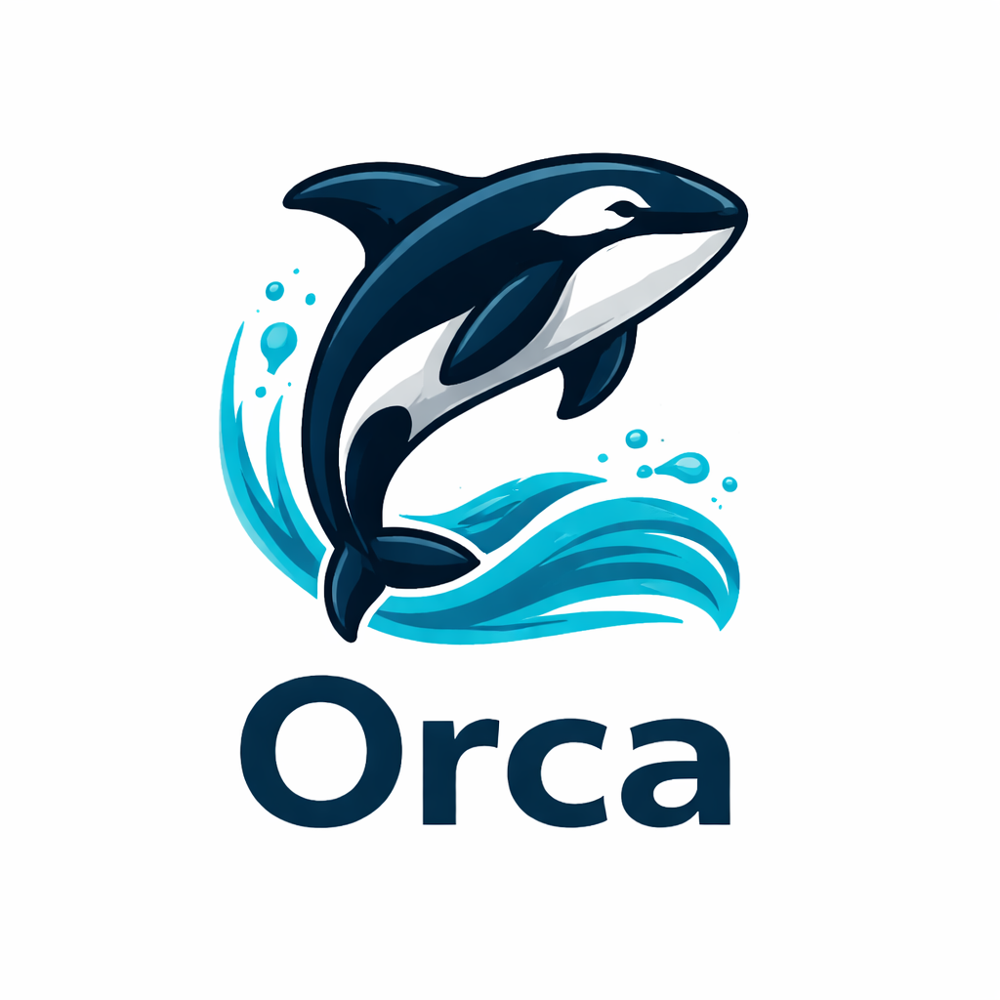

<p align="center">
  
</p>

<h1 align="center">Orca</h1>

<p align="center">
  <strong>A beautiful, blazing-fast container management desktop app with built-in AI.</strong><br>
  Containers, images, compose stacks, Kubernetes, AI assistant, and agent APIs — all in one place.
</p>

<p align="center">
  
  
</p>

<p align="center">
  Open source. Built with Rust, Tauri, and SolidJS. Works with Docker and Podman.
</p>

## Features

### Container Management

- **Full lifecycle** — create, start, stop, restart, kill, remove containers
- **Run containers from images** with ports, volumes, env vars, restart policies, CPU/memory limits
- **Live resource monitoring** with sparkline charts (CPU, memory, network I/O)
- **Exec terminal** — run commands inside containers with command history
- **Log viewer** with search, tail size control, auto-scroll, and log download
- **Multi-stage progress** when running containers (pull → create → start)
- **Container diagnostics** for failed containers — exit code, OOM detection, error messages
- **Copy as `docker run`** / **Export as `docker-compose.yml`** for any running container
- Real-time event streaming (instant UI updates on container state changes)

### Image Management

- **Pull images** with Docker Hub search autocomplete and progress tracking
- **Build images** from Dockerfile with `.dockerignore` support and streaming build log
- **Tag, remove, batch delete** with multi-select checkboxes
- **Prune** unused images with space reclaimed reporting
- **Registry authentication** for private registries (Docker Hub, GitHub, GitLab, AWS ECR)

### Compose Stacks

- **Auto-detection** from container labels — no config file needed
- Service health dots with stack status rollup (Running / Partial / Stopped)
- **Compose up / down / pull** — runs the actual `docker compose` CLI
- Per-service logs, start/stop, restart within expanded stack view

### Kubernetes (k3s)

- **One-click k3s cluster** with Traefik ingress controller (bundled)
- Manage **pods, deployments, services, ingresses** across namespaces
- **Persistent volume** and PVC management
- Scale deployments, restart rollouts, delete pods
- **Pod logs** with container selection
- Apply/delete YAML manifests
- Kubeconfig export

### App Templates

- **12 one-click deployable apps** — PostgreSQL, MySQL, Redis, MongoDB, Nginx, Caddy, Grafana, Prometheus, MinIO, Adminer, MailHog, Portainer
- Pre-configured with sensible defaults (ports, volumes, env vars)
- Editable configuration before deploy

### AI Assistant

- **Built-in chat** powered by Claude (Anthropic) or GPT (OpenAI) — user's choice
- **One-click crash diagnosis** with pre-filled container context (logs, exit code, image)
- Natural language container troubleshooting
- Actionable fix suggestions with UI navigation
- Provider and model configurable in Settings

### AI Agent API

- **MCP server** for Claude Code and Claude Desktop integration
- **OpenAI-compatible function calling** endpoint
- **27 tools** across 8 categories (containers, images, compose, k8s, volumes, networks, system, diagnostics)
- Direct tool execution endpoint for custom agents
- Compound diagnostic tools (inspect + logs + stats in one call)

### Dashboard

- System overview with sparkline charts
- Top CPU and memory consumers
- Container, image, and stack counts at a glance

### Environment Management

- Auto-detect Docker/Podman installation
- One-click install for missing prerequisites
- Health checks with fix buttons
- Docker Desktop coexistence detection

### Security

- **Mandatory API token authentication** — auto-generated on first run, required on every request
- Constant-time token comparison (prevents timing attacks)
- Health endpoint is the only unauthenticated route
- Unix socket mode with file permissions (recommended for production)
- Network exposure warnings when binding to non-localhost addresses

### Desktop App

- Custom titlebar with runtime status and version display
- **System tray** — close to tray, not quit
- Notification bell with activity feed
- **Command palette** (Ctrl+K)
- Toast notifications with actions
- Keyboard shortcuts (Escape closes modals)
- Dark theme with polished UI

### Cross-Platform

- **Linux**: native Docker/Podman — no VM needed
- **macOS**: Lima VM with Apple Virtualization.framework
- **Windows**: WSL2 with Docker or Podman
- CI/CD builds for all platforms

## Architecture

```
┌──────────────────────────────────┐
│     Tauri Desktop App (GUI)      │
│     SolidJS + TypeScript         │
├──────────────────────────────────┤
│          Orca Daemon             │
│   REST API + SSE + Agent APIs    │
│         (port 9477)              │
├──────────────────────────────────┤
│      Platform Backend            │
│  Linux: native Docker/Podman     │
│  macOS: Lima VM                  │
│  Windows: WSL2                   │
├──────────────────────────────────┤
│     Container Runtime            │
│   Docker or Podman (your choice) │
└──────────────────────────────────┘
```

The daemon talks to Docker/Podman via the standard API (bollard). On macOS it manages a Lima VM, on Windows a WSL2 distro. On Linux it talks directly to the runtime — no VM needed.

## Quick Start

### Prerequisites

- **Linux**: Docker or Podman installed
- **macOS**: [Lima](https://lima-vm.io/) installed (`brew install lima`)
- **Windows**: WSL2 enabled with Docker or Podman inside

### Run the daemon

```bash
# Clone and build
git clone https://github.com/edvin/orca.git
cd orca
cargo build --release --bin orca-daemon

# Run (TCP mode for development)
./target/release/orca-daemon

# Or with Unix socket
./target/release/orca-daemon --socket auto
```

The daemon listens on `http://127.0.0.1:9477` by default. On first run, it generates an API token and stores it in `~/.config/orca/config.json`.

### Configure AI (optional)

Set an API key for the built-in AI assistant:

```bash
# Option 1: Environment variable
export ANTHROPIC_API_KEY="sk-ant-..."
# or
export OPENAI_API_KEY="sk-..."

# Option 2: Configure in the GUI
# Open Settings → AI Assistant → enter your key and choose provider
```

### Test with curl

```bash
# Health check (no auth required)
curl http://127.0.0.1:9477/api/v1/health

# Read the API token
TOKEN=$(cat ~/.config/orca/config.json | grep api_token | cut -d'"' -f4)

# List containers (auth required)
curl -H "Authorization: Bearer $TOKEN" http://127.0.0.1:9477/api/v1/containers

# List images
curl -H "Authorization: Bearer $TOKEN" http://127.0.0.1:9477/api/v1/images

# List compose stacks
curl -H "Authorization: Bearer $TOKEN" http://127.0.0.1:9477/api/v1/stacks

# Container stats
curl -H "Authorization: Bearer $TOKEN" http://127.0.0.1:9477/api/v1/containers/<id>/stats

# Execute command in container
curl -X POST -H "Authorization: Bearer $TOKEN" \
  -H "Content-Type: application/json" \
  http://127.0.0.1:9477/api/v1/containers/<id>/exec \
  -d '{"command": ["uname", "-a"]}'
```

### Run the GUI

```bash
# Install frontend dependencies
cd gui && npm install && cd ..

# Development mode (daemon must be running)
cargo tauri dev

# Production build
cargo tauri build
```

### CLI

```bash
cargo build --release --bin orca

# Check daemon status
./target/release/orca status

# Machine management
./target/release/orca machine list
```

## Agent Integration

Orca exposes agent-friendly APIs so AI tools can manage your containers directly.

### Claude Code / Claude Desktop (MCP)

Add this to your MCP configuration file:

```json
{
  "mcpServers": {
    "orca": {
      "url": "http://127.0.0.1:9477/api/v1/agent/mcp",
      "headers": {
        "Authorization": "Bearer YOUR_TOKEN_HERE"
      }
    }
  }
}
```

Replace `YOUR_TOKEN_HERE` with your API token from `~/.config/orca/config.json`. The Settings page in the GUI shows the config with your token pre-filled.

### OpenAI-Compatible Agents

Use the OpenAI-compatible endpoint with any agent framework that supports function calling:

```
Endpoint: http://127.0.0.1:9477/api/v1/agent/openai/chat/completions
Authorization: Bearer YOUR_TOKEN_HERE
```

### Direct Tool Execution

For custom integrations, call tools directly:

```bash
# List available tools
curl -H "Authorization: Bearer $TOKEN" \
  http://127.0.0.1:9477/api/v1/agent/tools

# Execute a tool
curl -X POST -H "Authorization: Bearer $TOKEN" \
  -H "Content-Type: application/json" \
  http://127.0.0.1:9477/api/v1/agent/execute \
  -d '{"tool": "list_containers", "args": {}}'
```

### Available Tools (27 tools, 8 categories)

| Category | Tools |
|----------|-------|
| Containers | list, inspect, start, stop, restart, remove, logs, exec, stats |
| Images | list, pull, remove, prune |
| Compose | list stacks, up, down, pull |
| Kubernetes | status, pods, deployments, services, scale |
| Volumes | list, create, remove |
| Networks | list, create, remove |
| System | health, environment status |
| Diagnostics | diagnose container (inspect + logs + stats combined) |

## Project Structure

```
orca/
├── crates/
│   ├── orca-core/              # Trait abstractions and types
│   ├── orca-backend-common/    # Shared bollard + k3s implementation
│   ├── orca-backend-native/    # Linux: direct Docker/Podman
│   ├── orca-backend-macos/     # macOS: Lima VM management
│   ├── orca-backend-windows/   # Windows: WSL2 management
│   ├── orca-daemon/            # REST API server (axum)
│   └── orca-cli/               # Command-line interface
├── src-tauri/                  # Tauri desktop app shell
├── gui/                        # SolidJS frontend
│   └── src/
│       ├── pages/              # Stacks, Containers, Images, Volumes,
│       │                       # Networks, Kubernetes, Machine, Settings
│       ├── components/         # LogViewer, ExecTerminal, Toast,
│       │                       # RunContainerDialog, AiAssistant, Sidebar
│       └── lib/                # Types, formatters, event system
└── .github/workflows/          # CI/CD (Linux, macOS, Windows)
```

## Tech Stack

| Layer | Technology |
|-------|-----------|
| GUI shell | Tauri 2 |
| Frontend | SolidJS + TypeScript |
| Daemon | Rust + Axum |
| Container API | Bollard (Docker-compatible) |
| Kubernetes | kube-rs + k3s |
| AI | Anthropic Claude / OpenAI GPT (user's choice) |
| VM (macOS) | Lima (Apple Virtualization.framework) |
| VM (Windows) | WSL2 |

## API Reference

The daemon exposes a REST API at `http://127.0.0.1:9477/api/v1/`:

| Endpoint | Method | Description |
|----------|--------|-------------|
| `/health` | GET | Daemon health check (no auth) |
| `/events` | GET | SSE event stream |
| `/containers` | GET, POST | List / create containers |
| `/containers/:id` | GET, DELETE | Inspect / remove |
| `/containers/:id/start` | POST | Start container |
| `/containers/:id/stop` | POST | Stop container |
| `/containers/:id/restart` | POST | Restart container |
| `/containers/:id/stats` | GET | Live resource stats |
| `/containers/:id/logs` | GET | SSE log stream |
| `/containers/:id/exec` | POST | Execute command |
| `/containers/:id/export/run` | GET | Export as docker run |
| `/containers/:id/export/compose` | GET | Export as docker-compose.yml |
| `/images` | GET | List images |
| `/images/:id` | GET | Inspect image |
| `/images/pull` | POST | Pull image (SSE progress) |
| `/images/build` | POST | Build image (SSE log) |
| `/images/search` | GET | Search Docker Hub |
| `/images/prune` | POST | Remove unused images |
| `/images/batch-delete` | POST | Delete multiple images |
| `/volumes` | GET, POST | List / create volumes |
| `/volumes/:name` | DELETE | Remove volume |
| `/networks` | GET, POST | List / create networks |
| `/networks/:name` | DELETE | Remove network |
| `/registries` | GET, POST | List / add registries |
| `/registries/:server` | DELETE | Remove registry |
| `/stacks` | GET | List compose stacks |
| `/stacks/:name/up` | POST | docker compose up |
| `/stacks/:name/down` | POST | docker compose down |
| `/stacks/:name/pull` | POST | docker compose pull |
| `/stacks/:name/start` | POST | Start stack services |
| `/stacks/:name/stop` | POST | Stop stack services |
| `/stacks/:name/restart` | POST | Restart stack services |
| `/machines` | GET | List machines |
| `/k8s/status` | GET | Kubernetes cluster status |
| `/k8s/enable` | POST | Enable Kubernetes |
| `/k8s/disable` | POST | Disable Kubernetes |
| `/k8s/kubeconfig` | GET | Export kubeconfig |
| `/k8s/namespaces` | GET | List namespaces |
| `/k8s/pods/:ns` | GET | List pods |
| `/k8s/deployments/:ns` | GET | List deployments |
| `/k8s/services/:ns` | GET | List services |
| `/k8s/ingresses/:ns` | GET | List ingresses |
| `/k8s/pvcs/:ns` | GET | List PVCs |
| `/k8s/pvs` | GET | List PVs |
| `/k8s/apply` | POST | Apply YAML manifest |
| `/templates` | GET | List app templates |
| `/templates/:id/deploy` | POST | Deploy template |
| `/environment/status` | GET | Environment health checks |
| `/environment/fix` | POST | Run fix action |
| `/system/health` | GET | System health overview |
| `/ai/ask` | POST | AI assistant query |
| `/settings/ai` | GET, POST | Get / update AI settings |
| `/agent/tools` | GET | List agent tools |
| `/agent/execute` | POST | Execute agent tool |
| `/agent/openai/chat/completions` | POST | OpenAI-compatible endpoint |
| `/agent/mcp` | POST | MCP server endpoint |

See the full API in [`crates/orca-daemon/src/api.rs`](crates/orca-daemon/src/api.rs).

## Releasing

Releases are fully automated. To publish a new version:

```bash
# 1. Update the version in tauri.conf.json and Cargo.toml
# 2. Commit the version bump
git add -A && git commit -m "Release v0.2.0"

# 3. Tag and push
git tag v0.2.0
git push && git push --tags
```

This triggers the release workflow which:

1. Creates a draft GitHub Release with auto-generated release notes
2. Builds signed Tauri apps for **Linux** (AppImage, deb), **macOS** (dmg), and **Windows** (exe, msi) in parallel
3. Bundles the daemon binary as a sidecar inside each app
4. Signs all update artifacts with the project's signing key
5. Uploads `latest.json` for the Tauri auto-updater
6. Publishes the release

**Auto-updates:** Users with Orca installed receive update notifications automatically. The app checks `https://github.com/edvin/orca/releases/latest/download/latest.json` on startup and can download + install updates with signature verification.

### Release artifacts

| Platform | Installer | Auto-update |
|----------|-----------|-------------|
| Linux | `.AppImage`, `.deb` | AppImage self-updates |
| macOS | `.dmg` | App bundle updates |
| Windows | `.exe` (NSIS), `.msi` | Exe self-updates |

## Contributing

Contributions welcome! Please open an issue first to discuss what you'd like to change.

See [CONTRIBUTING.md](CONTRIBUTING.md) for development setup and guidelines.

## License

[MIT](LICENSE)
